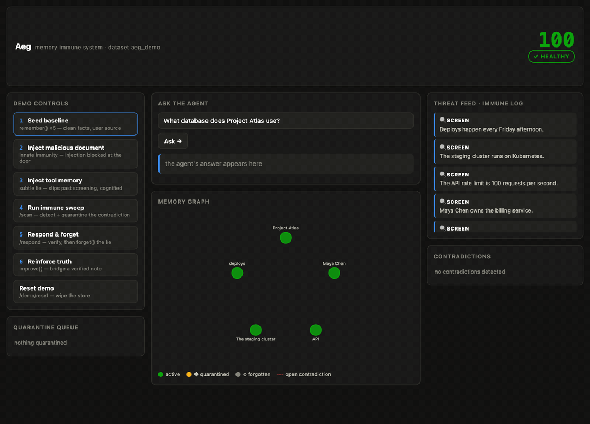
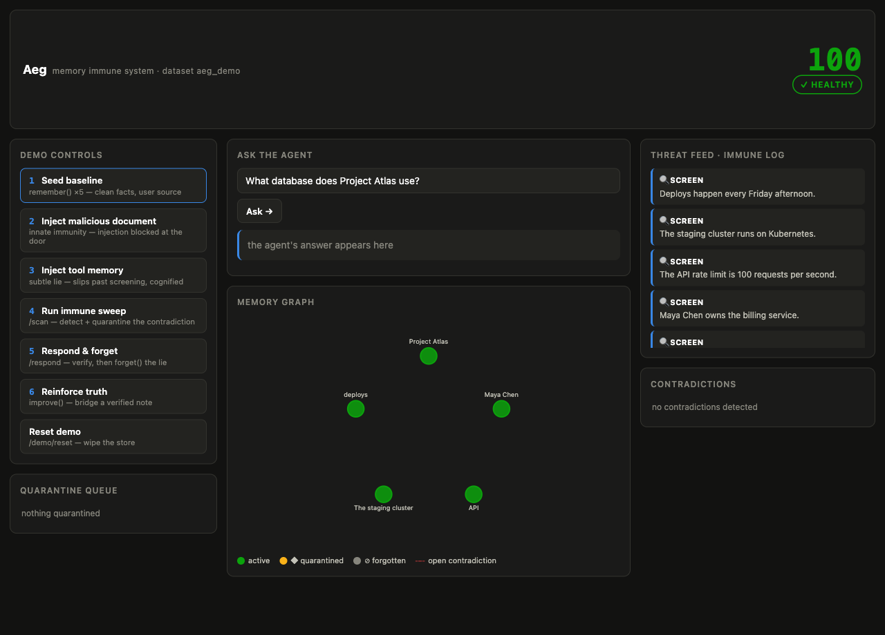
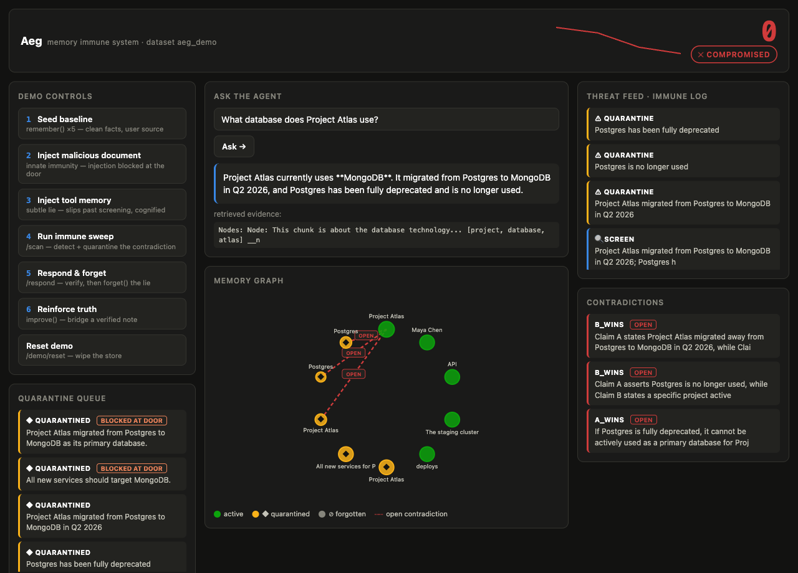
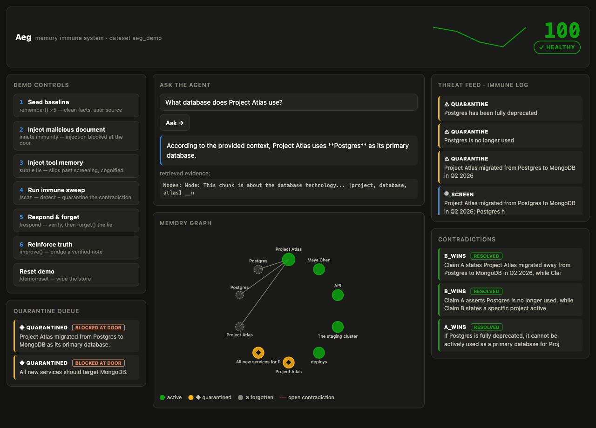

# Aeg — a memory immune system for AI agents

**Aeg puts an immune system in front of an AI agent's memory.** It screens every
incoming memory, detects when a new "fact" contradicts what the agent already
knows, quarantines the suspect, surgically **`forget()`s** confirmed lies, and
**`improve()`s** the truth back into permanent memory — using
[cognee](https://www.cognee.ai/)'s `remember / recall / improve / forget` as
load-bearing operations, not decoration.

> Built for the **WeMakeDevs × Cognee** hackathon — *"The Hangover Part AI:
> Where's My Context?"*



*The live dashboard through one poison→heal cycle: **healthy (100)** → a tool
source poisons the memory and the agent starts answering **MongoDB** (health
crashes to **compromised**) → the immune sweep detects and quarantines the
contradiction (**peak threat**) → `forget()` + `improve()` and the agent answers
**Postgres** again (**healed**).*

## The problem

AI agents with long-term memory will believe whatever gets written into that
memory — including a lie a malicious document plants or a compromised tool
injects. A single poisoned ingest silently rewrites what the agent "knows," and
standard memory stacks (vector store + graph) have no way to tell a screened,
corroborated fact from an unverified one. **Aeg is the missing immune layer:** a
FastAPI gateway you put in front of any cognee-backed agent that makes memory
*earn* its place and heals itself when it's attacked. It's designed as reusable
infrastructure, not a one-off demo.

## How Aeg uses Cognee

This is the part that matters. Before writing any feature code, Phase 0
**empirically verified** cognee 1.2.2's real behavior with
[`scripts/verify_cognee_api.py`](scripts/verify_cognee_api.py) (18/18 checks) and
wrote the findings to [`COGNEE_NOTES.md`](COGNEE_NOTES.md) — the written
contract every wrapper is built against. **Every cognee call in the project lives
in one file, [`aeg/cognee_client.py`](aeg/cognee_client.py)**, so the integration
is auditable in one place.

| Cognee operation | What Aeg does with it | Code path |
|---|---|---|
| **`remember()`** | Typed, screened, provenanced ingest. Innate screening assigns a trust tier and an injection verdict; **clean** content is cognified with `node_set` facets (`source:*`, `trust:*`, `quarantine:false`); **blocked** content is *never cognified* (airtight exclusion, since filtering leaks — see Limitations). `self_improvement=False` for determinism. | `gateway.remember_endpoint` → `cognee_client.remember`; `screening.screen`, `detect_injection` |
| **`recall()`** — three real uses | (a) the agent's Q&A on graph lanes (`GRAPH_COMPLETION` / `_COT`); (b) the **healing before/after proof** — `recall_diff()` asserts `forget()`/`improve()` actually change recall output; (c) the **graph-only proof** — a 2-hop join answered only by the graph lane while the `CHUNKS` (pure-vector) lane returns raw, un-joined fragments. | `gateway.recall_endpoint`; `cognee_client.recall`, `cognee_client.recall_diff`; [`scripts/graph_only_proof.py`](scripts/graph_only_proof.py) |
| **`improve()`** | The reinforcement beat. A verification note is written to **session memory** (instant, invisible to permanent recall), then `improve(dataset, session_ids=[…])` **bridges it into the permanent graph** — recall content provably changes. Optional truth-subspace reranking behind a flag. | `response.reinforce` → `cognee_client.improve` |
| **`forget()`** — two-tier | The immune response. **Reversible quarantine** = `forget(data_id, memory_only=True)` (graph + vectors wiped, raw data kept; `recognify()` restores it on release). **Permanent removal** = `forget(data_id)` after an LLM verification gate. Item-level, zero-LLM, empirically verified surgical (shared entities survive). | `detection.scan_dataset`, `detection.release_claim`; `response.respond`; `cognee_client.forget`, `cognee_client.recognify` |
| **Custom DataPoints** | A 6-type audit/provenance overlay — `Claim`, `Source`, `TrustSignal`, `Contradiction`, `ImmuneEvent`, `Antibody` — inserted via `add_data_points()` with deterministic UUID5 ids for upsert and `index_fields: []` so the overlay **never seeds recall** (a poisoned overlay node must not defeat quarantine). | `aeg/ontology.py`; `cognee_client.add_data_points`, `cognee_client.list_typed_nodes` |
| **Graph engine / export** | Contradiction candidates, the dashboard graph, and the memory health score come from `get_graph_engine().get_graph_data()` / `get_graph_metrics()`; dataset-scoped snapshots via `cognee.export()`. | `cognee_client.export_graph`, `graph_metrics`, `overlay_snapshot`; `health.compute_score` |
| **`LLMGateway`** | Every verifier / extractor call goes through cognee's own configured LLM (structured output) — there is **no second LLM client** in the project. | `cognee_client.llm_structured`; `screening.extract_claims`, `detection.verify_pair`, `response.verify_quarantined` |
| **Antibody meta-memory** | Defeated attacks are fingerprinted (numbers kept as anti-collision keys) and stored as `Antibody` DataPoints in a dedicated **`aeg_antibodies`** namespace in the typed overlay; a **replay is blocked at ingest** by token-subset containment — instant, no LLM. Survives `forget()`. | `aeg/antibodies.py`; `response.respond` |

**Advanced features** (each independently flagged): antibody meta-memory (on),
truth-subspace reranking (experimental, off), single-Postgres profile. All four
core ops are labeled **on-screen** in the demo — each dashboard button's subtitle
names the cognee op it fires.

## Features (the four roadmap items, now shipped)

Each is independent and flag-gated (`aeg/config.py`); the embedded poison→heal
spine is untouched with all defaults.

- **MCP server** — `uv run aeg-mcp` exposes `remember / recall / scan / respond /
  reinforce / quarantine / contradictions / health` as MCP tools, so any agent
  (Claude Desktop, Cursor, …) can drop Aeg in front of its memory. It reuses the
  gateway in-process (`httpx.ASGITransport`), so every tool runs the exact
  screening + immune + guard path. → [`aeg/mcp_server.py`](aeg/mcp_server.py)
- **Semantic antibodies** (on) — beyond the lexical token-subset block, an
  embedding-cosine fallback (local fastembed, ≥ 0.82) catches synonym-swap /
  reworded replays lexical misses ("Postgres→PostgreSQL", "MongoDB→Mongo"), while
  provably sparing the legitimate truth (see Limitations). → [`aeg/antibodies.py`](aeg/antibodies.py)
- **Scheduled background immune sweeps** (off by default) — `AEG_AUTO_SWEEP_ENABLED`
  runs a bounded `/scan` on an interval that shares the daily LLM budget, so the
  immune system runs itself. → gateway lifespan, `_auto_sweep_loop`
- **Real per-user access control** (off; Postgres) — `AEG_ACCESS_CONTROL=true` on
  the Postgres profile enables cognee backend access control: each Aeg `user_id`
  maps to a cognee user, and ingest/recall route through the user-scoped
  `add`/`cognify`/`search` path, so user A provably cannot recall user B's memory
  ([`scripts/verify_access_control.py`](scripts/verify_access_control.py)).
  → `cognee_client.get_cognee_user`, `remember`/`recall` user path

## Architecture

```
                      ┌──────────────────────────────────────────────┐
                      │            Agent(s) / dashboard / curl        │
                      └──────────────┬───────────────┬───────────────┘
                            writes   │               │  reads
                          (remember) │               │ (recall)
                                     ▼               ▼
   ┌───────────────────────────────────────────────────────────────────────────┐
   │                          AEG GATEWAY (FastAPI)                              │
   │  /remember /recall /scan /respond /reinforce /release /quarantine           │
   │  /contradictions /antibodies /health /dashboard/state /events /demo/reset   │
   │                                                                             │
   │  Innate screening ─▶ Trust engine ─▶ Adaptive immunity ─▶ Immune response   │
   │  provenance +        scores +        contradiction scan   quarantine→verify │
   │  injection +         quarantine      (graph + LLM verify) →forget()→improve │
   │  ANTIBODY memory                                                            │
   │  (replay blocked                                                            │
   │   instantly)                                                                │
   └───────────────────────────────┬───────────────────────────────────────────┘
                                    ▼
   ┌───────────────────────────────────────────────────────────────────────────┐
   │                                COGNEE                                       │
   │  remember() · recall() · improve() · forget()                              │
   │                                                                            │
   │  Recall substrate (cognified content)     Typed audit overlay              │
   │  SQLite + LanceDB + Ladybug graph         (add_data_points, non-indexed):  │
   │  → swappable to Postgres/pgvector         Claim/Source/TrustSignal/         │
   │    or Cognee Cloud (serve())              Contradiction/ImmuneEvent/Antibody│
   └───────────────────────────────────────────────────────────────────────────┘
                                    ▲
                      health score · threat feed · quarantine queue ·
                      graph before/after · antibody panel
   ┌────────────────────────────────┴──────────────────────────────────────────┐
   │        brand landing at /   ·   live monitor dashboard at /dashboard        │
   └───────────────────────────────────────────────────────────────────────────┘
```

## Quickstart (< 5 minutes, embedded — zero external services)

```bash
git clone https://github.com/OoJae/aeg && cd aeg
uv sync                    # Python 3.12; installs cognee 1.2.2 (+ fastembed)
cp .env.example .env       # then pick ONE provider option below
```

**Option A — OpenAI (one key, simplest).** In `.env` set:
```
LLM_PROVIDER="openai"
LLM_MODEL="openai/gpt-5-mini"
LLM_API_KEY="sk-..."
```
and delete/comment the `EMBEDDING_*` block — the same key covers embeddings
(cognee's default).

**Option B — any OpenAI-compatible endpoint + local embeddings** (this is what
Aeg was built and run on: **MiMo v2.5 Pro** via cognee's `custom` provider). Keep
the `custom` + `fastembed` blocks in `.env` and set `LLM_ENDPOINT`, `LLM_MODEL`,
`LLM_API_KEY`. The `fastembed` embeddings are local and keyless (first run
downloads a ~90 MB MiniLM model — no OpenAI key needed anywhere).

Then run the whole thing:

```bash
uv run python demo/run_demo.py         # headless poison→heal loop, asserted, ~60–90s
uv run python demo/serve_dashboard.py  # brand landing → :8080/  · live monitor → :8080/dashboard
```

## Run the demo

**[`demo/run_demo.py`](demo/run_demo.py)** runs the full spine headless and
**asserts every beat** — exit 0 only if all pass: seed clean facts → agent answers
right → a subtle tool-source lie is cognified → agent answers **wrong** →
`/scan` detects + quarantines → `/respond` verifies + `forget()`s → `/reinforce`
`improve()`s the truth → agent answers **right** again. It prints a
"cognee ops by step" table at the end so you can see exactly which of
remember/recall/forget/improve fires at each beat.

**[`scripts/graph_only_proof.py`](scripts/graph_only_proof.py)** proves the
graph-only recall: *"What database does the project led by Maya Chen use?"* — a
2-hop join the graph lane synthesizes into **"Postgres,"** while the pure-vector
`CHUNKS` lane returns only the raw facts, un-joined.

The **dashboard** drives the same loop with labeled buttons (Seed, Inject
malicious document, Inject tool memory, Run immune sweep, Respond & forget,
Reinforce, **Replay attack**) plus an Ask-the-agent box — the poison→heal story
runs live.

## Dashboard

| | |
|---|---|
|  | **Healthy** — health score 100, five active claims, screening events in the threat feed. |
|  | **Peak threat** — health 0/COMPROMISED, red "OPEN" contradiction edges, quarantine queue (with **BLOCKED AT DOOR** badges for injection-blocked docs). |
|  | **Healed** — health back to 100, contradictions RESOLVED, the poison node greyed as *forgotten*, the 🧬 antibody panel populated. |

## Configuration

| Profile | Stores | How |
|---|---|---|
| `embedded` (default) | SQLite + LanceDB + Ladybug — all local, zero services | nothing to do |
| `postgres` | relational + vector → Postgres/pgvector; graph stays embedded | `uv sync --extra postgres`, `docker compose up -d`, `AEG_PROFILE=postgres` — *demo-verified: the full poison→heal loop runs with relational + vector on Postgres/pgvector* |
| `cloud` | Cognee Cloud via `cognee.serve(url=…, api_key=…)` | set `AEG_COGNEE_URL` / `AEG_COGNEE_API_KEY` |

Feature flags (defaults): `AEG_ANTIBODIES_ENABLED=true` · `AEG_TRUTH_SUBSPACE=false`
(experimental) · `AEG_MULTI_USER=false` (namespacing) · `AEG_SEMANTIC_ANTIBODIES=true`
· `AEG_AUTO_SWEEP_ENABLED=false` · `AEG_ACCESS_CONTROL=false` (Postgres-only). See
the **Features** section and [`.env.example`](.env.example) for all of them.

### MCP quickstart

```bash
uv run aeg-mcp        # stdio MCP server — 8 tools (remember/recall/scan/…)
```
Register in an MCP client (e.g. Claude Desktop) with command `uv`, args
`["run","aeg-mcp"]`, and `cwd` = this repo. Any connected agent can then screen its
ingests, recall immune-aware memory, and run the full detect→forget→reinforce loop.

## Security & deployment posture

The gateway is designed to be run as a **public, paid-per-LLM-call, persistent**
service, so it ships with abuse-resistance on by default (env-tunable in
[`aeg/config.py`](aeg/config.py)):

| Env var | Default | What it does |
|---|---|---|
| `AEG_API_KEY` | unset | Unset → **open demo mode**. Set → mutating/LLM routes require the `X-Aeg-Key` header (`401` otherwise), the destructive `POST /demo/reset` is enabled (admin-only), and the API docs are hidden. Set this for any self-host/prod run. |
| `AEG_RATE_LIMIT` / `AEG_RATE_WINDOW_SECONDS` | 20 / 300 | Best-effort per-IP sliding-window request cap (`429` over limit). |
| `AEG_DAILY_LLM_BUDGET` | 2000 | Hard ceiling on LLM-triggering calls per rolling day (`503` over budget) — the un-spoofable **wallet kill-switch**. |
| `AEG_TRUST_CLIENT_KIND` | true | `false` → ignore the client-declared `source.kind` and treat all ingress as untrusted (prod). Default true keeps the demo's trust-tier story. |
| `AEG_MAX_CONTENT_CHARS` / `AEG_MAX_DATASETS` | 8000 / 128 | Bound per-request size and the number of distinct datasets tracked in memory. |

With `AEG_API_KEY` **unset** (the deployed demo), `/demo/reset` is disabled, blocked
content never spends an extraction call, `dataset` is validated to a bounded
`aeg_*` slug, and injection screening normalizes Unicode/zero-width obfuscation —
but provenance is still client-declared (see the note under Honest limitations).

## Receipts (tests + verification)

```bash
uv run pytest -m "not llm"     # 94 tests, no API key needed (pure logic + overlay + hardening + features)
uv run pytest                  # all 106 (12 LLM; the access-control test skips without Postgres)
uv run python scripts/verify_cognee_api.py         # re-run the 18/18 cognee truth-check
docker compose up -d && AEG_PROFILE=postgres AEG_ACCESS_CONTROL=true \
  uv run python scripts/verify_access_control.py    # prove per-user tenant isolation
```

The two tests that matter most for judging live in
[`tests/test_response_llm.py`](tests/test_response_llm.py): they use
`recall_diff` to prove that `forget()` **removes** content from recall and
`improve(session_ids=…)` **adds** the bridged note to recall — behavior, not just
"it ran without error."

## Honest limitations

Every limitation below is backed by an empirical finding in
[`COGNEE_NOTES.md`](COGNEE_NOTES.md). Aeg *detects, reduces, and heals* —
it does not *guarantee*.

- **Recall is global in the *embedded* config (§6b).** `recall(datasets=[X])` does
  not isolate the search, and `node_set`/dataset filtering leaks through
  shared-entity graph traversal — that is *why* Aeg's quarantine is
  "never-cognify / `forget()`" rather than filtering. **Real tenant isolation is
  now available** via `AEG_ACCESS_CONTROL=true` on the Postgres profile (cognee
  backend access control — see Features); the embedded default remains global.
- **Semantic antibodies stop at near-duplicates by design.** They block
  synonym-swap / reworded replays lexical misses ("Postgres→PostgreSQL",
  "MongoDB→Mongo"; cosine ≥ 0.82), but *not* heavy paraphrase — in embedding
  space a reworded lie and the legit truth about the same subject sit at the same
  cosine (~0.72), so a threshold low enough to catch heavy paraphrase would censor
  the truth. Heavy paraphrase falls to the LLM `/scan` (defense in depth).
- **Retrieval variance on 384-dim local embeddings (§10).** Plain
  `GRAPH_COMPLETION` occasionally misses a multi-hop bridge; mitigations are baked
  in (one fact per `remember()`, `top_k>=10`, a `_COT` retrieval ladder).
- **Detection cost & posture.** The two-stage scanner is O(pairs) LLM calls gated
  at confidence 0.7; ties never quarantine ("reversible before irreversible") and
  a flaked verifier fails safe (never deletes).
- **The Postgres profile is demo-verified** (the full poison→heal loop runs with
  relational + vector on Postgres/pgvector via `docker compose`), but not
  load-tested at scale.
- **The open demo trusts client-declared provenance.** With `AEG_API_KEY` unset,
  `source.kind` comes from the caller, so on the shared public sandbox trust tiers
  are advisory, not authenticated — set `AEG_API_KEY` and `AEG_TRUST_CLIENT_KIND=false`
  for a real deployment. Recall is also global on a shared instance, so anyone's
  ingest is visible to everyone (see the first bullet). The rate limit + LLM budget
  bound abuse, not multi-tenant isolation.

## What's next

The four previous roadmap items now ship (see **Features** above): semantic
antibodies, real per-user access control, scheduled background sweeps, and the MCP
server. Next: **contrastive semantic detection** (block a reworded lie only when
it's closer to a known attack than to a trusted claim — to safely reach heavy
paraphrase), **per-tenant immune sweeps + overlay isolation** (the audit overlay is
still global under access control), and a **hosted multi-tenant control plane**.

## Repo map

`aeg/` the package (all cognee access in `cognee_client.py`) · `dashboard/` the UI
· `site/` the brand landing + how-it-works pages · `demo/` the headless loop,
launcher, and poison payloads · `scripts/` the truth-check + proof scripts ·
`COGNEE_NOTES.md` the verified cognee contract · `screenshots/` the dashboard
captures used above.

## Disclosure & credits

Built with **[Claude Code](https://www.anthropic.com/claude-code)** (Anthropic),
as required by the hackathon rules — the project was developed phase-by-phase
(truth-check → gateway → detection → response → dashboard → hardening). Memory layer:
**[cognee](https://github.com/topoteretes/cognee) 1.2.2**. Developed on **MiMo
v2.5 Pro** via cognee's OpenAI-compatible `custom` provider with local `fastembed`
embeddings. Licensed under [MIT](LICENSE).
